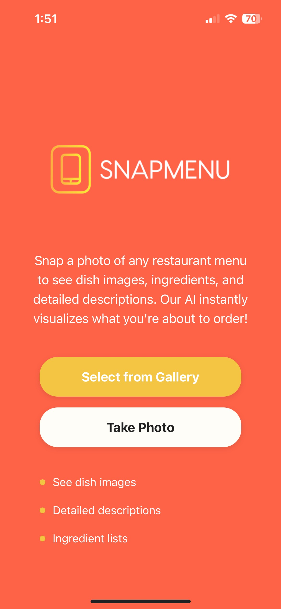
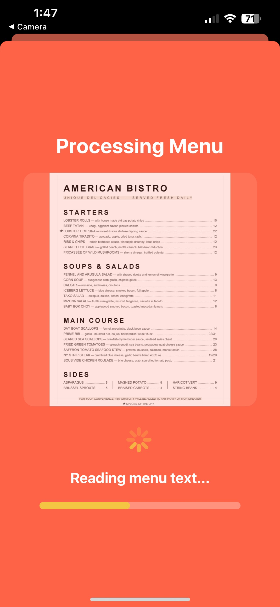
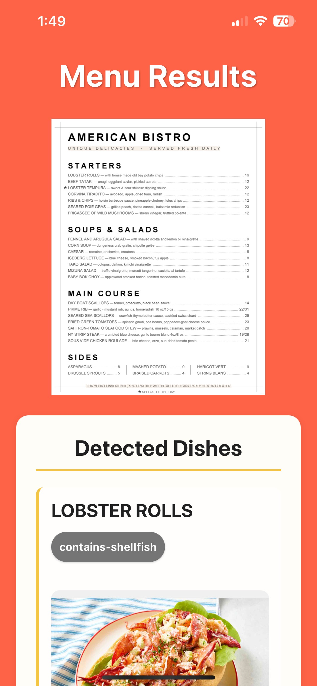
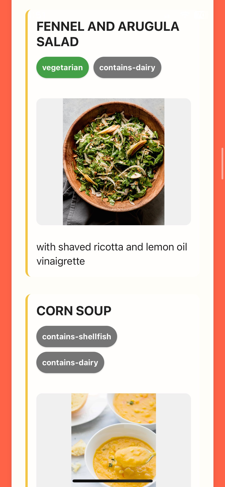
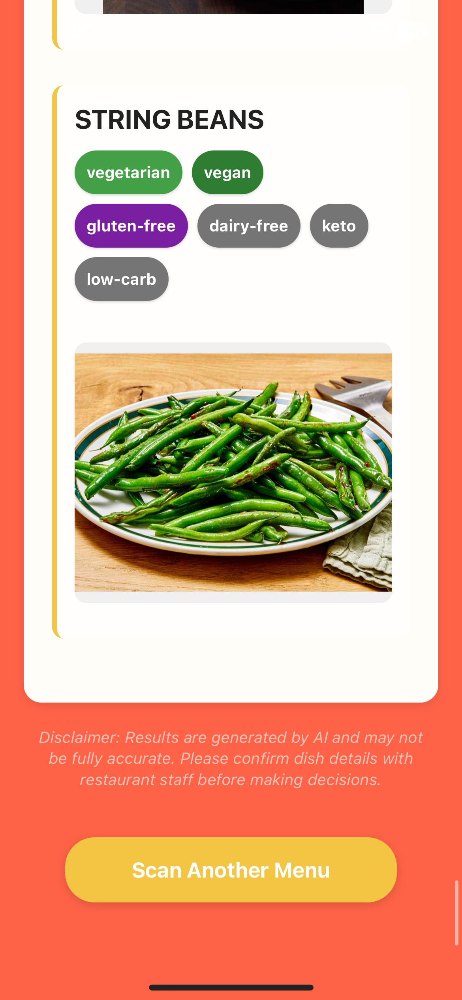

<p align="center">
  
</p>

# 🍽️ SnapMenu

SnapMenu is an AI-powered mobile app that helps users understand restaurant menus by simply taking a photo. It extracts dishes using OCR, enriches them with detailed descriptions and tags using GPT, and displays real food images pulled from the web.

---

## 📱 Features

- 📸 Upload or take a photo of a printed menu
- 🧠 Automatic OCR and dish name extraction
- ✨ Enriched descriptions and dietary tags (vegan, spicy, etc.) via OpenAI
- 🖼️ Real dish images pulled from Google Images (via SerpAPI)
- ⚡ FastAPI backend with CI/CD and public deployment

---

## 🛠️ Tech Stack

### 🧩 Frontend

- [Expo](https://expo.dev/) (React Native)
- `expo-image-picker` for menu uploads
- `fetch` API for backend communication

### 🔧 Backend

- [FastAPI](https://fastapi.tiangolo.com/)
- `pytesseract` for OCR
- `openai` for GPT-based enrichment
- `requests` for API calls

- CI/CD: GitHub Actions + Render deployment

---

## 🔑 APIs Used

| API               | Purpose                                |
| ----------------- | -------------------------------------- |
| **Tesseract OCR** | Text extraction from menu image        |
| **OpenAI GPT-4**  | Dish enrichment (descriptions/tags)    |
| **SerpAPI**       | Real food image search (Google Images) |

---

## 🚀 Setup Instructions

### 🖥️ Backend (FastAPI)

1. Clone the repo and install dependencies:

   ```bash
   cd backend
   python -m venv venv
   source venv/bin/activate   # Windows: venv\Scripts\activate
   pip install -r requirements.txt
   ```

2. Create a `.env` file:

   ```env
   OPENAI_API_KEY=your_openai_key
   SERPAPI_KEY=your_serpapi_key
   ```

3. Run locally:

   ```bash
   uvicorn app.main:app --reload --host 0.0.0.0 --port 8000
   ```

### 📱 Frontend (React Native with Expo)

1. Navigate to the mobile app folder:

   ```bash
   cd mobile-app
   npm install
   ```

2. Edit constants/Api.ts to use your backend URL:

   ```js
   export const API_CONFIG = {
     BASE_URL: "http://<your-local-ip>:8000",
   };
   ```

   ✅ Or use the deployed Render URL once live.

3. Start Expo:

   ```bash
   npx expo start
   ```

   Use Expo Go to scan the QR code and test on your phone.

---

## 🌐 Deployment

The backend is deployed via Render using GitHub integration:

- 📦 Auto-builds from `/backend` subdirectory
- 🔐 API keys stored as environment variables
- 🌍 Publicly accessible at:

  ```
  https://snapmenu-backend.onrender.com
  ```

---

## 🧪 CI/CD

- ✅ GitHub Actions for CI
  - Runs uvicorn build check on push
- 🚀 Render for Continuous Deployment

---

## System Requirements

- Python 3.10
- Tesseract-OCR (required for OCR)

### Installing Tesseract

- **Windows**: [Tesseract for Windows](https://github.com/UB-Mannheim/tesseract/wiki)
- **macOS**: `brew install tesseract`
- **Ubuntu**: `sudo apt install tesseract-ocr`

---

## 📷 Screenshots

<p align="center">
  
  &nbsp;&nbsp;&nbsp;&nbsp;
  
  &nbsp;&nbsp;&nbsp;&nbsp;
  
  &nbsp;&nbsp;&nbsp;&nbsp;
  
  &nbsp;&nbsp;&nbsp;&nbsp;
  
</p>

---

## 👨‍💻 Author

Jason Li  
[GitHub](https://github.com/jasonli2446)

---

## 📄 License

MIT License

---
